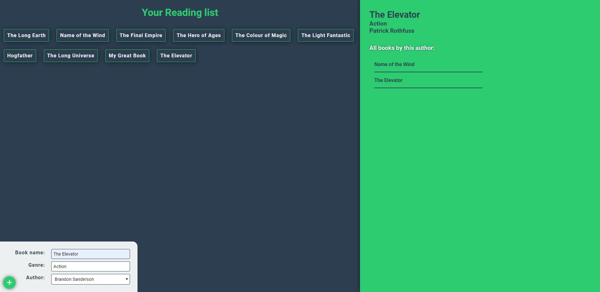

# React Apollo GraphQL MongoDB Project

> Application that brings books and book authors in the database using Graphql and adds a new book record to the database

## Quick Start

```bash
# Install dependencies server/client
cd server
npm install

cd client
npm install

# Serve on localhost:4000
npm run server

# React App on localhost:5000
npm run dev

or

# Serve and app start
npm start
```

### App screenshot


